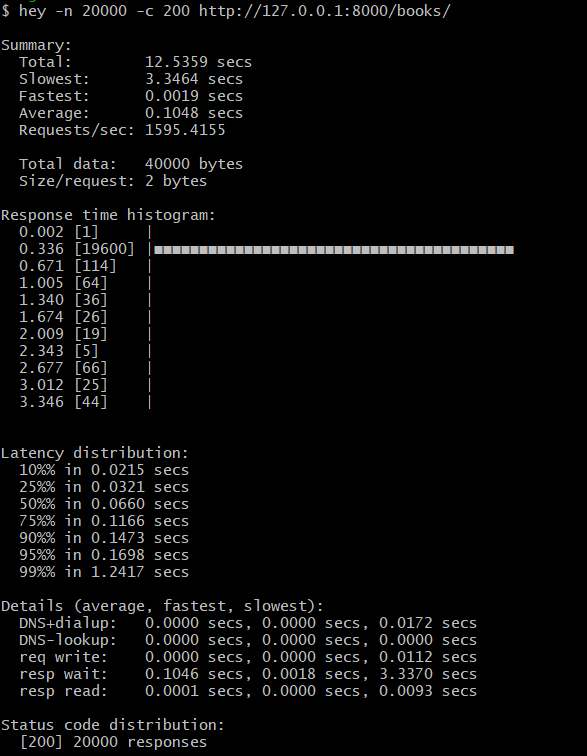
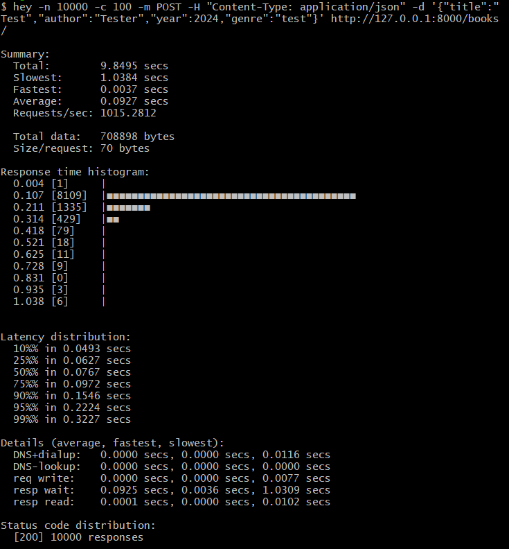

# 📋 python-fastapi-book-api — RESTful API реализующее CRUD операции с книгами

## 🛠️ Стек технологий и обоснование выбора

| Технология | Зачем |
|------------|-------|
| **Python / FastAPI** | Быстрый фреймворк для разработки API с поддержкой асинхронности |
| **PostgreSQL** | Тяжёлая БД для больших проектов с поддержкой асинхронности |
| **Python / Pydantic** | Библиотека для валидации и описания структуры данных с помощью классов |
| **Python / SQLModel** | "Надстройка" над SQLAlchemy с поддержкой Pydantic моделей |

## ⚙️ Ключевые возможности
- 📋 **CRUD** — Пользователь может выполнять CRUD-операции с книгами.
- 📊 **Swagger UI** — На основе кода генерируется схема по правилам OpenAPI, затем создаётся интерактивная страница, на которой можно протестировать все запросы к API.

## 🧪 Тест нагрузки
Так как API является асинхронным было принято решение провести нагрузочное тестирование API в обучающих целях. Для этой задачи была выбрана небольшая консольная утиита на языке Go под названием hey. На изображения ниже показаны результаты её работы с кратким выводом теста, в котором указаны общее время выполнения, RPC(запрос в секунду) и распределение задержки.
### GET-запросы

### POST-запросы

Можно заметить, что RPC для FastAPI довольно низкие, это объясняется тем, что тест и разработка выполнялись на одном устройстве с операционной системой Windows, которая делила ресурсы с воркерами

## 🛠 Что можно улучшить
- Расширить функционал
- Добавить Docker
- Добавить Redis(для кеширования запросов -> увеличение RPC)

## 👤 Контакты
Курушкин Сергей — Студент, backend-разработчик, увлечён разработкой на Python.
- GitHub: [@gray-de](https://github.com/gray-de)
- LinkedIn: https://www.linkedin.com/in/sergei-kurushkin-b44059405/
- Telegram: [@gray13542](https://t.me/gray13542)
- Email: thegraycanal13542@gmail.com